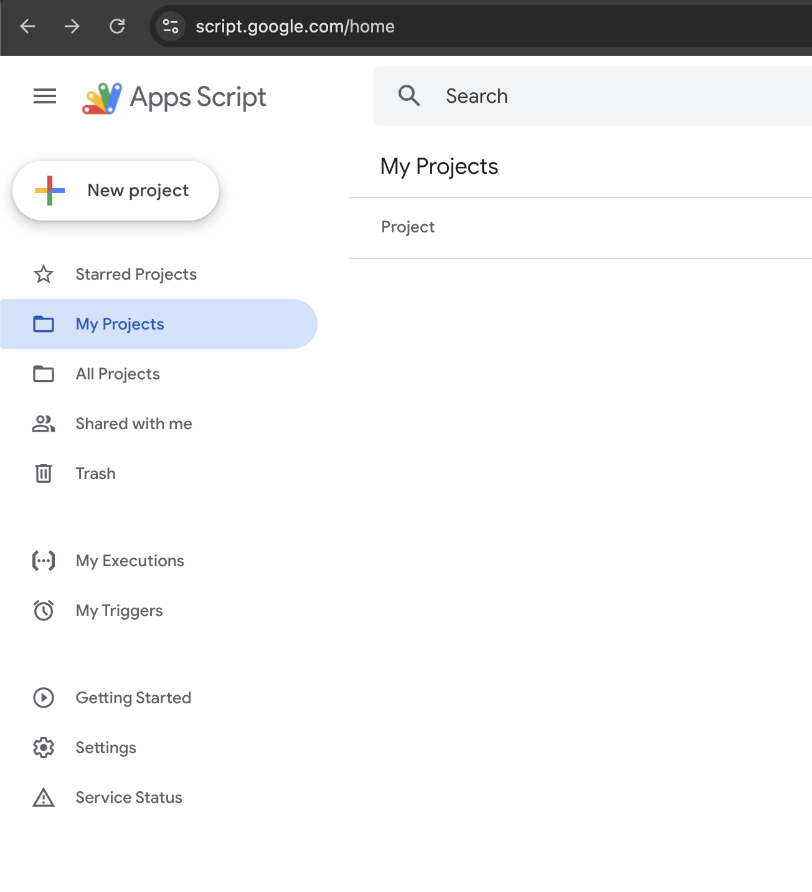
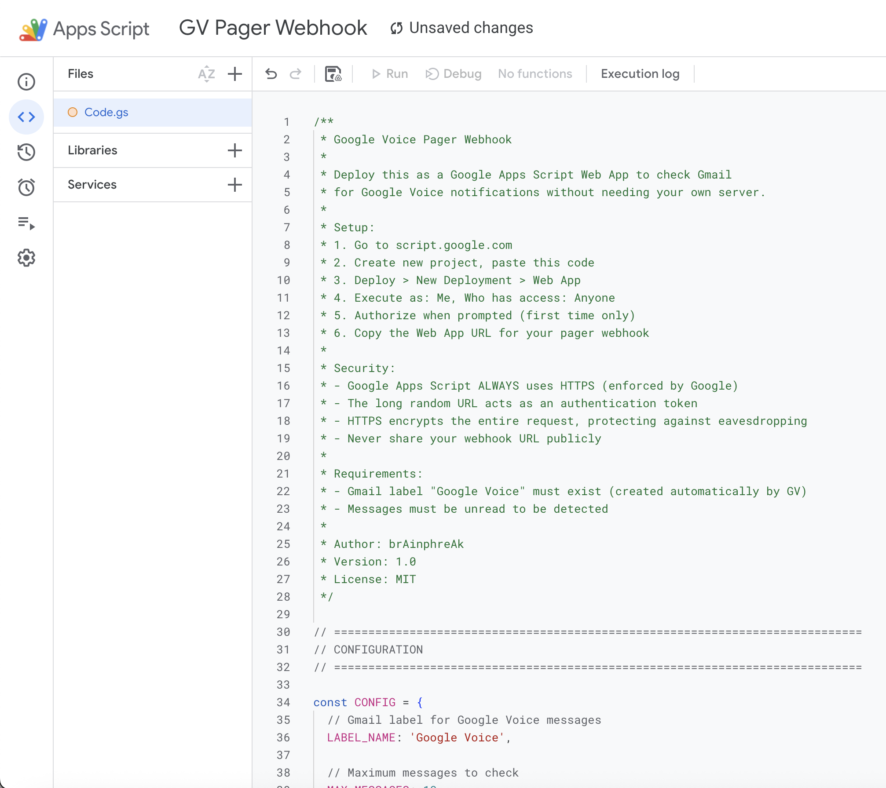
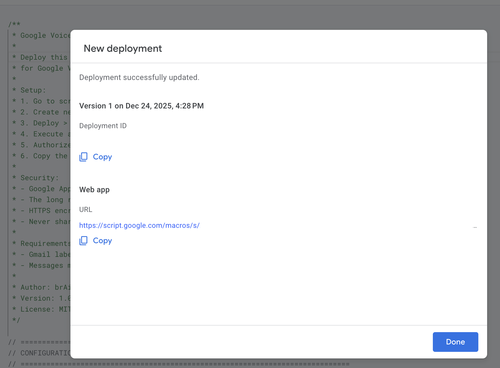
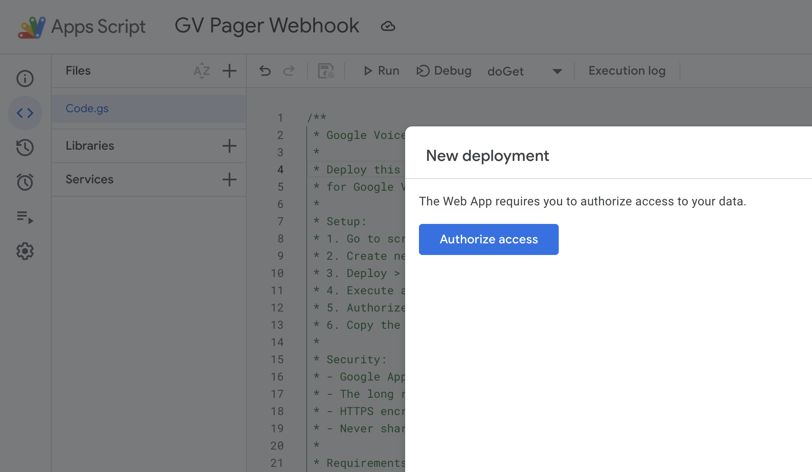
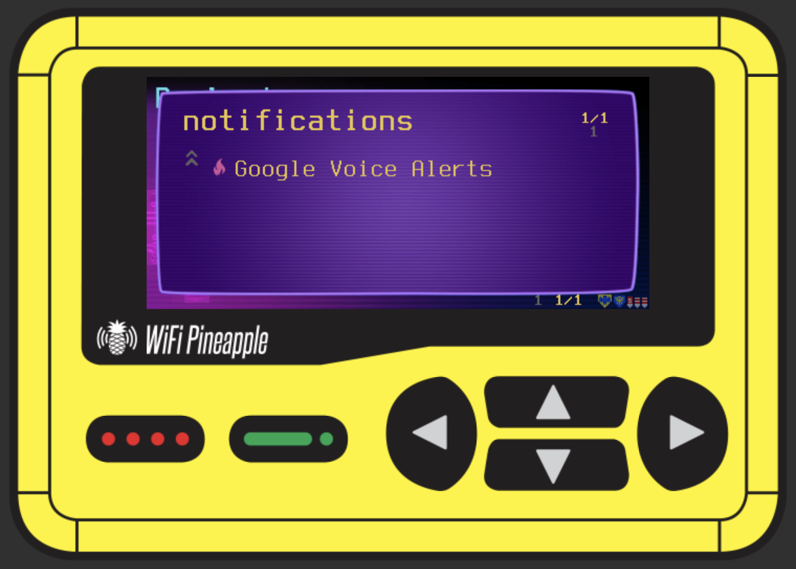
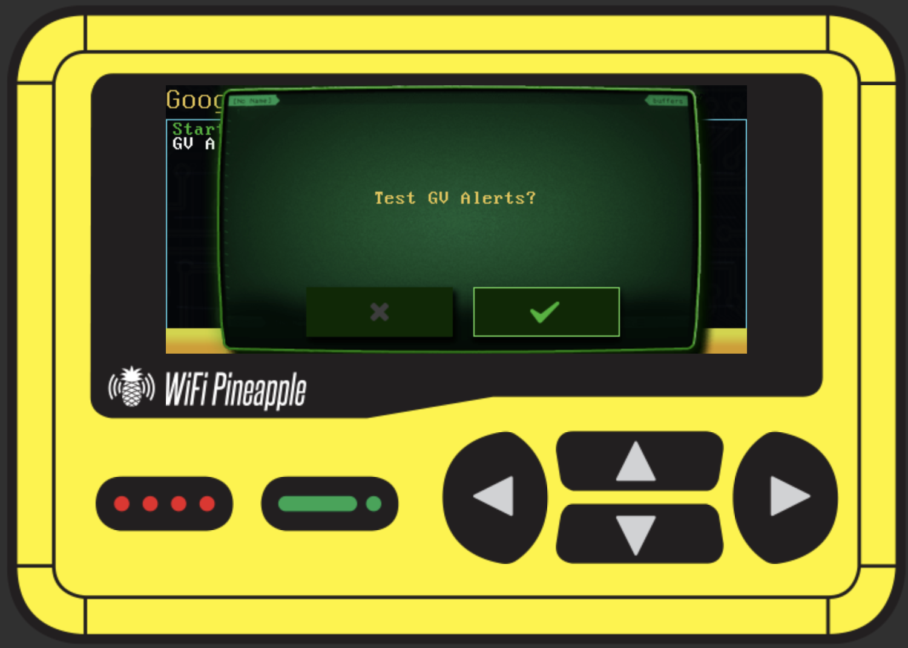
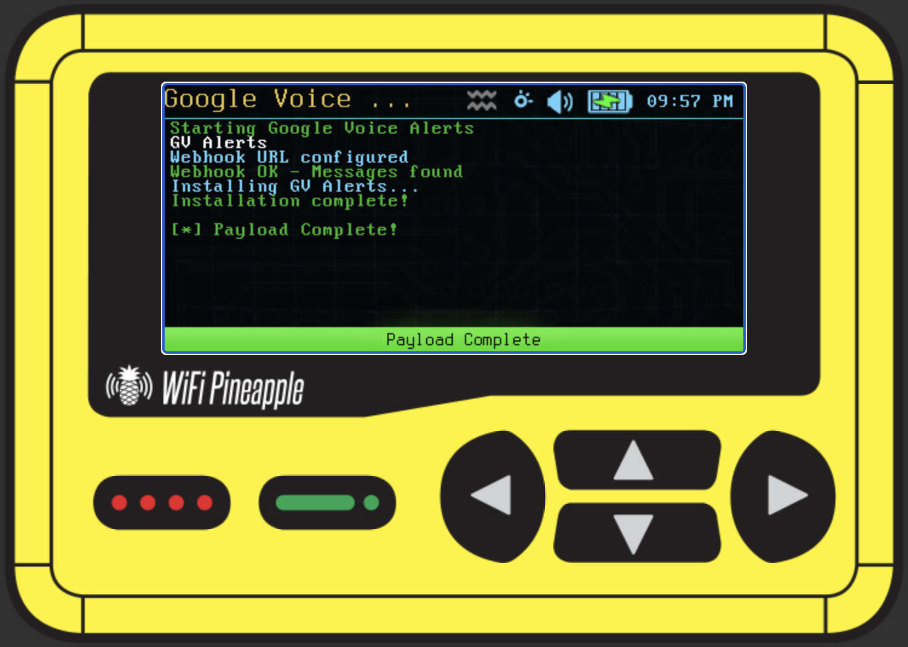

# Google Voice Alerts


Receive Google Voice calls, texts, and voicemails as alerts on your WiFi Pineapple Pager.

## Features

- Real-time notifications for:
  - Missed calls
  - Voicemails (with transcription preview)
  - Text messages (with preview)
- Configurable check interval (in minutes)
- Hash-based duplicate detection (no repeated alerts)
- Bandwidth optimization (minimal data when no new messages)
- Toggle on/off from payload menu
- No Gmail labels or filters required

## How It Works

```
Phone Call/Text -> Google Voice -> Email to Gmail -> Webhook checks Gmail -> Pager Alert
```

The webhook runs on Google's free infrastructure and checks your Gmail for Google Voice notification emails. It uses hash-based detection to avoid duplicate alerts and minimize bandwidth usage.

## Files

```
├── google-apps-script.js       # Webhook code (deploy to Google)
└── notifications/
    └── gv_alerts/
        └── payload.sh          # Pager payload
```

## Installation

### Step 1: Deploy the Webhook

1. Go to [script.google.com](https://script.google.com)
2. Click **New Project**



3. Delete any existing code and paste the contents of `google-apps-script.js`



4. Click **Save** (name it "GV Alerts Webhook")
5. Click **Deploy** > **New deployment**



6. Select type: **Web app**
7. Set:
   - Execute as: **Me**
   - Who has access: **Anyone**


8. Click **Deploy**
9. Click **Authorize access** and allow Gmail permissions



10. Copy the **Web app URL** - this is your webhook

**Test it:** Open the URL in a browser. You should see:
```json
{"hasMessages":false,"count":0,"msgHash":"","alertText":""}
```

### Step 2: Configure and Install the Payload

1. Edit `notifications/gv_alerts/payload.sh` and configure:
   ```bash
   WEBHOOK_URL="https://script.google.com/macros/s/YOUR_SCRIPT_ID_HERE/exec"
   CHECK_INTERVAL=2  # Minutes between checks
   ```

2. Copy the `notifications` folder to your pager:
   ```bash
   scp -r notifications root@172.16.52.1:/root/payloads/user/
   ```

3. On the pager, go to: **PAYLOADS** > **notifications** > **Google Voice Alerts**



4. Launch the payload


5. You can test the connection first, or select **Yes** to install





6. Select **Yes** to install





## Usage

Launch the payload from **PAYLOADS** > **notifications** > **Google Voice Alerts**:

| Prompt | Yes | No |
|--------|-----|-----|
| GV Alerts is ON/OFF - Turn OFF/ON? | Toggle state | More options... |
| Check for messages now? | Check immediately | More options... |
| Clear message history? | Clear (re-alert all) | More options... |
| Uninstall GV Alerts? | Uninstall | Exit |

## Uninstalling

To uninstall, launch the payload and navigate through the menu options:


## Technical Details

### Bandwidth Optimization

The payload passes the last message hash to the webhook. If unchanged, the webhook returns a minimal response (~70 bytes) instead of full message content (~500+ bytes). This significantly reduces data usage for frequent polling.

| Scenario | Response Size |
|----------|--------------|
| No messages | ~50 bytes |
| Messages unchanged | ~70 bytes |
| New messages | ~500+ bytes |

### State Management

The payload uses the cron job to determine enabled state - if the cron job exists, the pager is enabled. The hash file is stored in the payload directory for self-containment:

| File | Purpose |
|------|---------|
| `.last_hash` | Last message hash (duplicate detection) |

### Cron Service

The payload automatically manages the cron service:
- **Install:** Starts and enables cron if not running
- **Uninstall:** Stops and disables cron if no other jobs remain

## Troubleshooting

### No alerts received

1. **Check if enabled (cron job exists):**
   ```bash
   crontab -l | grep gv_alerts
   ```

2. **Check cron service is running:**
   ```bash
   /etc/init.d/cron status
   ```

3. **Test webhook manually:**
   ```bash
   curl -sL "YOUR_WEBHOOK_URL"
   ```

4. **Check for unread GV emails in Gmail**

### Repeated alerts for same messages

The hash-based detection should prevent this. If it happens:
1. Clear the hash via the payload menu
2. Or manually: `rm /root/payloads/user/notifications/gv_alerts/.last_hash`

## Security

- **HTTPS only:** Google Apps Script enforces HTTPS
- **URL as token:** The long random URL acts as authentication
- **Keep it secret:** Never share your webhook URL publicly

## Credits

- **Author:** brAinphreAk
- **Version:** 2.0
- **License:** MIT
